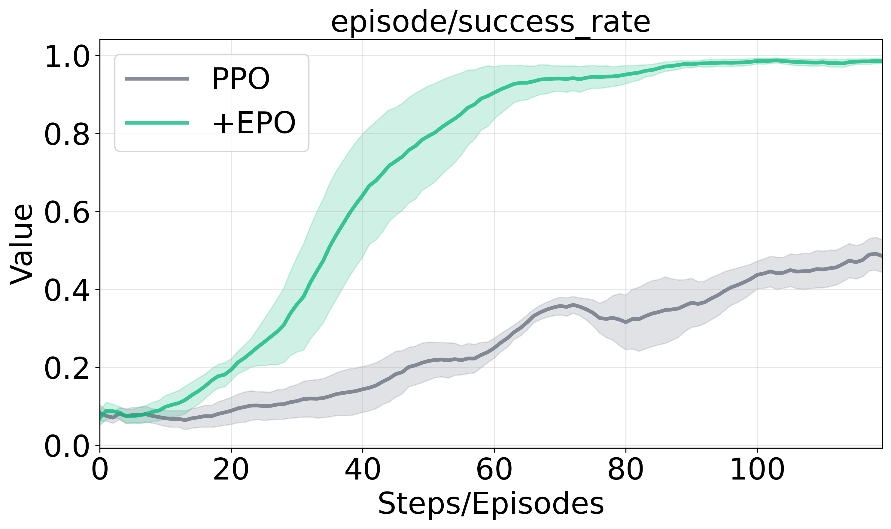
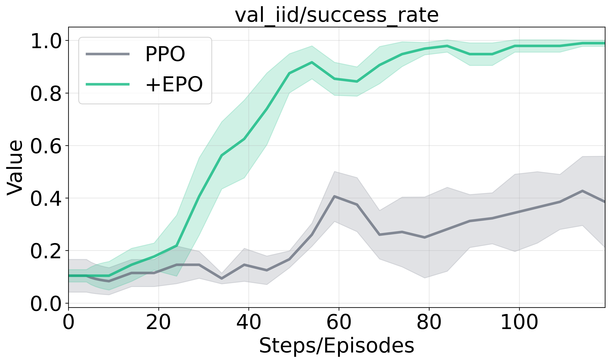
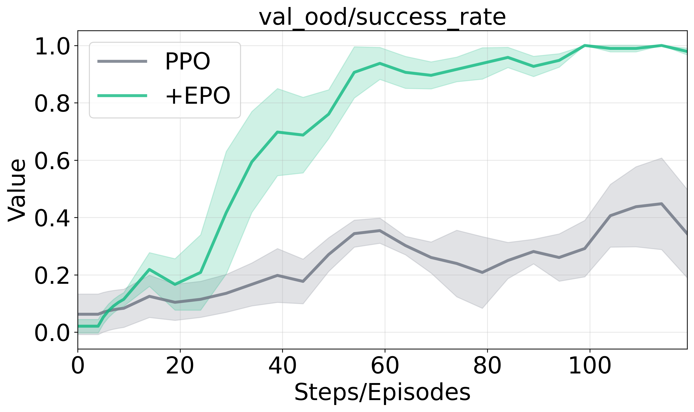

# EPO: Entropy-regularized Policy Optimization for LLM Agents Reinforcement Learning

<p align="center">
  <a href="#">
    </a>
  &nbsp;
  <a href="#">
    </a>
</p>

## Abstract and Results

This repository contains the implementation of **EPO (Entropy-regularized Policy Optimization)**, a novel approach for training large language model (LLM) agents through reinforcement learning that introduces entropy regularization to improve training stability and generalization performance in multi-turn agent environments. Our experimental results demonstrate significant improvements over baseline methods, with EPO-enhanced methods achieving substantially higher reward accumulation while maintaining superior stability. In ScienceWorld, PPO+EPO reaches approximately 2x higher training rewards (15 vs. 8) with smooth monotonic trajectories, while ALFWorld shows consistent improvements with GRPO+EPO maintaining steady upward trends throughout training. The validation performance reveals rapid convergence to high success rates (>0.8 for both IID and OOD) within 40 training steps, compared to baseline methods that struggle to exceed 0.4 even after 100 steps.

<p align="center">
  
  
  
</p>

**(a-c) ScienceWorld experimental results contrasting PPO and PPO+EPO performance across training reward accumulation, IID validation, and OOD validation metrics.**

## Key Features

- **Entropy-regularized Policy Optimization**: Novel RL algorithm that incorporates entropy regularization for improved training dynamics
- **Multi-turn Agent Training**: Supports long-horizon, multi-step agent-environment interactions
- **Enhanced Generalization**: Achieves superior performance on both in-distribution (IID) and out-of-distribution (OOD) evaluation settings
- **Stable Training Dynamics**: Provides smooth, monotonic training trajectories with improved convergence
- **Environment Support**: Compatible with ScienceWorld, ALFWorld, and other agent environments

## Installation

### Prerequisites

- Python 3.10 or 3.12
- CUDA-compatible GPU
- Conda or virtual environment

### Environment Setup

#### For ScienceWorld

Follow the instructions in `instruct_to_run_sciworld.sh`:

```bash
# Step 1: Create and activate environment
python3.10 -m venv /common/users/cj574/env/verl-agent-sciworld/
source /common/users/cj574/env/verl-agent-sciworld/bin/activate

# Step 2: Install ScienceWorld environment
pip3 install scienceworld
pip install gym==0.23.1
pip install selenium

# Step 3: Install verl-agent dependencies
pip3 install torch==2.6.0 --index-url https://download.pytorch.org/whl/cu124
pip3 install wheel
pip3 install flash-attn==2.7.4.post1 --no-build-isolation
pip3 install -e .
pip3 install vllm==0.8.5
```

#### For ALFWorld

Follow the instructions in `instruct_to_run_alfworld.sh`:

```bash
# Step 1: Create and activate environment
conda create -n verl-agent-alfworld python==3.12 -y
conda activate verl-agent-alfworld

# Step 2: Install ALFWorld environment
pip3 install gymnasium==0.29.1
pip3 install stable-baselines3==2.6.0
pip install alfworld
alfworld-download -f

# Step 3: Install verl-agent dependencies
pip3 install torch==2.6.0 --index-url https://download.pytorch.org/whl/cu124
pip3 install flash-attn==2.7.4.post1 --no-build-isolation
pip3 install -e .
pip3 install vllm==0.8.5
pip3 install pandas==2.2.3
```

## Usage

### Running Experiments

The repository provides example scripts for running EPO-enhanced training:

```bash
# ScienceWorld PPO + EPO
bash examples/general_running_server.sh --environment sciworld --rl_algorithm "ppo" --seed 0 --lr 3e-6 --lr_warmup_steps_ratio 0.1 --min_lr_ratio 0.2 --warmup_style cosine --entropy_smooth True --enable_smooth_weights True --entropy_smooth_mask_mode "token" --entropy_smooth_min_ratio 0 --entropy_smooth_max_ratio 2.0 --entropy_smooth_out_range_penalty 0.05 --model_path "/local_path/7b_model" --model_load_method "local" --log_prob_micro_batch_size_per_gpu 8 --ppo_micro_batch_size_per_gpu 8 --ppo_mini_batch_size 64 --total_epochs 125 

# ALFWorld PPO + EPO  
bash examples/general_running_server.sh --environment alfworld --rl_algorithm "ppo" --seed 1 --lr 5e-6 --lr_warmup_steps_ratio 0.1 --min_lr_ratio 0.2 --warmup_style cosine --entropy_smooth True --entropy_smooth_mask_mode "token" --entropy_smooth_min_ratio 0 --entropy_smooth_max_ratio 2.0 --entropy_smooth_out_range_penalty 0.1 --model_path "/local_path/3b_model" --model_load_method "local" --enable_smooth_weights True 


## Acknowledgments

We gratefully acknowledge the contributions of the following projects and their developers:

- **[veRL](https://github.com/volcengine/verl)**: Volcano Engine Reinforcement Learning framework for LLMs
- **[verl-agent](https://github.com/langfengQ/verl-agent)**: A scalable training framework for long-horizon LLM/VLM agents
- **[ScienceWorld](https://github.com/allenai/ScienceWorld)**: Interactive text-based science environment for agent training
- **[ALFWorld](https://alfworld.github.io/)**: Text-based embodied AI environment for household tasks
- **[vLLM](https://github.com/vllm-project/vllm)**: High-throughput and memory-efficient inference and serving engine for LLMs

These frameworks and environments provided the essential infrastructure and testbeds that made our EPO research possible.